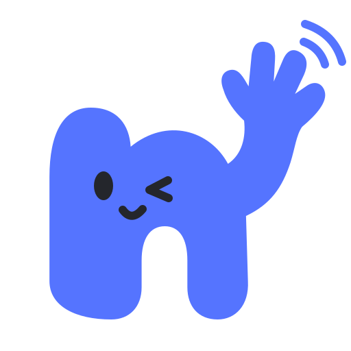
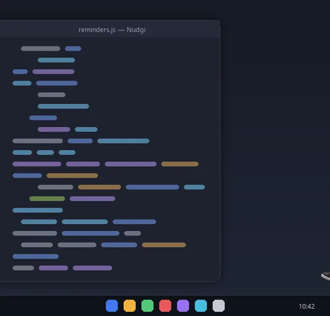
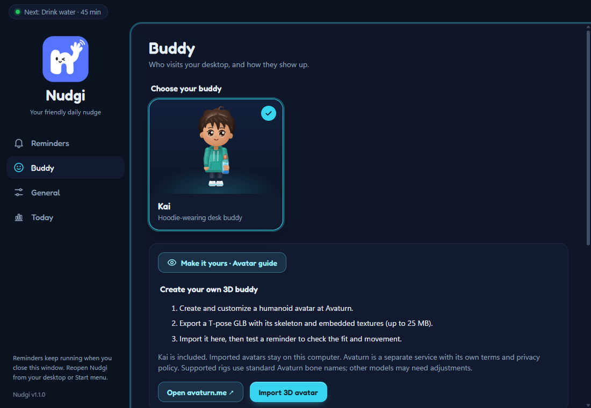

<div align="center">



# Nudgi

**A friendly desktop buddy that walks onto your screen and reminds you to drink water, stretch, call someone or take a break.**

[](https://github.com/vraj-p8/nudgi/releases/latest)
[](https://github.com/vraj-p8/nudgi/releases)
[](https://github.com/vraj-p8/nudgi/actions/workflows/test.yml)
[](LICENSE)


[**Download**](https://github.com/vraj-p8/nudgi/releases/latest) ·
[Report a bug](https://github.com/vraj-p8/nudgi/issues/new?template=bug_report.yml) ·
[Request a feature](https://github.com/vraj-p8/nudgi/issues/new?template=feature_request.yml) ·
[Changelog](CHANGELOG.md)



<sub>Shown with the author's own 3D avatar, imported locally. Nudgi ships with Kai; you can bring your own avatar too.</sub>

</div>

<details>
<summary><b>Table of contents</b></summary>

- [About](#about)
- [Features](#features)
- [Install](#install)
- [Usage](#usage)
- [Bring your own 3D avatar](#bring-your-own-3d-avatar)
- [Development](#development)
- [How it works](#how-it-works)
- [Privacy](#privacy)
- [Roadmap](#roadmap)
- [Contributing](#contributing)
- [License](#license)
- [Acknowledgments](#acknowledgments)

</details>

## About

Desktop notifications are easy to ignore. Nudgi sends a small character instead. Your buddy walks in from the
edge of the screen (or floats down with an umbrella, or peeks in), stands just above the taskbar and asks the
question you wrote: *"Hey, Vraj - did you drink water?"*. Answer **YES** and it celebrates with you. Choose
**Remind me later** and it walks off a little sad, then comes back after your snooze.

The buddy only ever says the text you configure. Everything runs locally on your PC.

<p align="center"></p>

## Features

- **Reminders you write.** Greeting, question, button labels and replies are all yours. Start from templates
  (water, call someone, stretch, eye break, posture, walk, vitamins, breathing) or a blank reminder.
- **Flexible schedules.** Every N minutes or at fixed times, with active hours, weekdays, snooze length and a
  daily goal with a progress meter (for example 💧 5 / 8 today).
- **Kai, a 3D buddy.** Rigged in Blender, animated procedurally: profile walking, turning to face you, drinking,
  cheering and throwing the umbrella. A 2D Kai takes over automatically if 3D graphics are unavailable.
- **Your own avatar.** Import an Avaturn GLB and it walks, holds the bottle and reacts just like Kai.
- **Personality without noise.** Your buddy looks toward your cursor, reacts to petting and pokes, has three entrance
  styles, and shows a rain cloud if you keep pressing "later" (it never adds words you did not write).
- **Stays out of the way.** Click-through overlay that never steals focus, waits while you are away or the screen
  is locked, pause from the tray, summon with **Ctrl+Alt+B**.
- **Customizable.** Buddy size, side of the screen, accent colour, bubble style, sounds, optional voice and
  launch at sign-in.

## Install

1. Download **Nudgi Setup 1.2.2.exe** (or the portable EXE) from the
   [latest release](https://github.com/vraj-p8/nudgi/releases/latest).
2. Run the installer and open **Nudgi** from the Start menu or the desktop shortcut.
3. Kai introduces himself, then reminds you to drink water every 45 minutes until you change it.

Windows builds are not code-signed yet, so SmartScreen may ask you to confirm. Each release lists SHA-256
checksums in `SHA256SUMS.txt`. Updating keeps your reminders, statistics, settings and imported avatar.

## Usage

| Action | How |
| --- | --- |
| Open settings | Click the tray icon, or open Nudgi from the Start menu |
| Summon your buddy now | **Ctrl+Alt+B** (configurable), or tray → **Summon buddy now** |
| Pause reminders | Tray → **Pause** (30 min, 1 hour, 2 hours or until tomorrow) |
| Test a reminder | Settings → Reminders → open a reminder → **Test on desktop** |
| Quit | Tray → **Quit Nudgi** (closing the settings window keeps reminders running) |

Settings has four sections: **Reminders** (with a live preview of your buddy and bubble), **Buddy**, **General**
and **Today** (daily progress, 7-day chart and streaks).

## Bring your own 3D avatar

Create an avatar of yourself on [Avaturn](https://avaturn.me/), export a T-pose GLB and import it from
**Settings → Buddy → Make it yours · Avatar guide**. The model stays on your computer. Step-by-step details and
supported rigs are in the [3D avatar guide](docs/CUSTOM-AVATAR.md).

## Development

Requirements: Windows 10 or 11 and Node.js 22 or later.

```powershell
git clone https://github.com/vraj-p8/nudgi.git
cd nudgi
npm ci
npm start
```

| Command | What it does |
| --- | --- |
| `npm start` | Run the app (tray, scheduler, overlay, settings) |
| `npm run demo` | Run the app and show a water reminder after a few seconds |
| `npm test` | Unit tests for the scheduler, settings store and tray menu |
| `npm run dev:web` | Serve the renderer pages at `http://localhost:5178` with a mock bridge |
| `npm run build` | Build the NSIS installer and portable EXE into `dist/` |
| `npm run icons` | Regenerate the app and tray icons from `assets/nudgi-mark.svg` |

End-to-end checks run the real app in an isolated profile under `output/`:

```powershell
.\node_modules\.bin\electron.cmd scripts/audit.cjs            # outcomes, stats, tray, hotkey, settings, validation
.\node_modules\.bin\electron.cmd scripts/verify-desktop.cjs   # walk / drop / peek entrances and answers
.\node_modules\.bin\electron.cmd scripts/verify-kai.cjs       # 2D Kai gait, landing and umbrella throw
.\node_modules\.bin\electron.cmd scripts/verify-avatar.cjs    # 3D motion, props and avatar switching
.\node_modules\.bin\electron.cmd scripts/verify-click.cjs     # real mouse: hover and click the bubble (moves your cursor)
```

Set `NUDGE_TEST_MODEL` to a local GLB to include imported-avatar checks. To rebuild 3D Kai, run
`blender --background --factory-startup --python scripts/build-kai.py` (Blender 5.2).

<details>
<summary><b>Project structure</b></summary>

```
src/
  main/         Electron main process: scheduler, settings store, tray, windows, IPC
  preload/      the narrow window.nudge bridge
  renderer/
    overlay/    the transparent stage that choreographs each reminder
    settings/   settings window (reminders, buddy, general, today)
    shared/     avatar engines (2D and 3D), props, effects, speech bubble, sounds
    vendor/     three.js r186
scripts/        build, capture and verification tools (including scripts/build-kai.py for Blender)
docs/           avatar guide, motion notes, branding, images
test/           node:test suites
```

</details>

## How it works

Electron's main process owns the scheduler, the tray icon and a transparent, always-on-top overlay window that
covers the work area of the display under your cursor. The overlay ignores the mouse except over the buddy and
the bubble, and it never takes focus. Renderers are plain ES modules with no bundler or framework. Kai and
imported avatars are drawn with vendored three.js and animated procedurally: two-bone IK for arms and legs, a
distance-driven gait with planted feet, finger grips around props, and critically damped springs for every pose
change. The 2D fallback is an SVG rig with the same public API. More in [docs/AVATAR-MOTION.md](docs/AVATAR-MOTION.md).

## Privacy

No account, analytics or network service. Reminders, statistics, settings and imported models stay in
`%APPDATA%\Nudge Buddy`. The only outbound link is the optional Avaturn button, which opens your browser.

## Roadmap

Possible next steps:

- Code-signed builds and an automatic updater
- macOS support
- Facial expressions (blinks and smiles) for 3D Kai
- Importing short video or GIF clips as an avatar

Ideas and votes are welcome in [issues](https://github.com/vraj-p8/nudgi/issues).

## Contributing

Bug reports, ideas and pull requests are welcome. Please read [CONTRIBUTING.md](CONTRIBUTING.md) and the
[Code of Conduct](CODE_OF_CONDUCT.md). Security issues: see [SECURITY.md](SECURITY.md).

## License

[MIT](LICENSE) © Vraj Patel. Third-party components are listed in [THIRD_PARTY_NOTICES.md](THIRD_PARTY_NOTICES.md).

## Acknowledgments

- [three.js](https://threejs.org/), [Electron](https://www.electronjs.org/), [Blender](https://www.blender.org/)
  and the [Fredoka](https://fonts.google.com/specimen/Fredoka) typeface.
- [Avaturn](https://avaturn.me/) for personal 3D avatars (an independent service, not affiliated with Nudgi).
